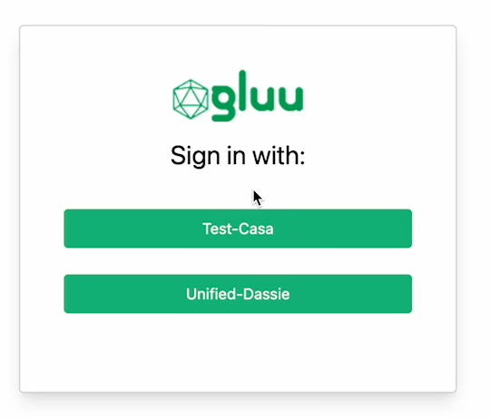

<!-- These are statistics for this repository-->
[![Contributors][contributors-shield]][contributors-url]
[![Forks][forks-shield]][forks-url]
[![Stargazers][stars-shield]][stars-url]
[![Issues][issues-shield]][issues-url]
[![Apache License][license-shield]][license-url]


# About Agama OpenID Connect Project

This repo is home to the Gluu Agama-openid project. This Agama project for 
connecting to external OpenID providers. Use this project to create an 
identity broker or OpenID discovery service.



## Where To Deploy

The project can be deployed to any IAM server that runs an implementation of the 
[Agama Framework](https://docs.jans.io/head/agama/introduction/) like 
[Janssen Server](https://jans.io/) and [Gluu Flex](https://gluu.org/flex/).


## How To Deploy

Different IAM servers may provide different methods and 
user interfaces from where an Agama project can be deployed on that server. 
The steps below show how the Agama-openid project can be deployed on the 
[Janssen Server](https://jans.io). 

Deployment of an Agama project involves three steps.

- [Downloading the `.gama` package from the project repository](#download-the-project) 
- [Adding the `.gama` package to the IAM server](#add-the-project-to-the-server)
- [Configure the project](#configure-the-project)

#### Pre-Requisites

Client credentials of the IDP of your choice will be required to configure 
this project, if the `DCR` is disabled on the IDP. 

### Download the Project

> [!TIP]
> Skip this step if you use the Janssen Server TUI tool to 
> configure this project. The TUI tool enables the download and adding of this 
> project directly from the tool, as part of the `community projects` listing. 

The project is bundled as 
[.gama package](https://docs.jans.io/head/agama/gama-format/). 
Visit the `Assets` section of the 
[Releases](https://github.com/GluuFederation/agama-openid/releases) to download 
the `.gama` package.

### Add The Project To The Server

The Janssen Server provides multiple ways an Agama project can be 
deployed and configured. Either use the command-line tool, REST API, or a 
TUI (text-based UI). Refer to 
[Agama project configuration page](https://docs.jans.io/head/admin/config-guide/auth-server-config/agama-project-configuration/) 
in the Janssen Server documentation for more details.


### Configure The Project

The Agama project accepts configuration parameters in JSON format. Every Agama 
project comes with a basic sample configuration file for reference.

This project must be configured using a JSON document that follows the structure
below:

```
{
"org.gluu.inbound.openid": {
"OP1_ID": { ... configs for identity provider 1 ... },
"OP2_ID": { ... configs for identity provider 2 ... },
...
}
}
```

Below is a typical configuration of the Agama-openid project. As shown, it contains
configuration parameters for the [flows contained in it](#flows-in-the-project):


Here is an example that configures an OP with DCR and an OAuth 2.0 provider:

### Sample JSON


```
{
    "org.gluu.inbound.openid":{
        "Gluu": {
            "host": "https://my.gluu.co", 
            "dcr": { 
                "enabled": true,
                "useCachedClient": true 
            },
            "oauth": { 
                "scopes": [ "openid" ] 
            },
            "provision": {
                "uidPrefix": "gluu-",
                "attribute": "sub"
            }
        },
        "Github": {
            "oauth": {
                "authzEndpoint": "https://github.com/login/oauth/authorize",
                "tokenEndpoint": "https://github.com/login/oauth/access_token",
                "userInfoEndpoint": "https://api.github.com/user",
                "clientId": "mangled",
                "clientSecret": "twisted",
                "scopes": [ "user" ]
            },
            "provision": {
                "uidPrefix": "github-",
                "attribute": "login"
            }
        }    
    }
}

```


### Test The Flow


Use a relying party implementation (like [jans-tarp](https://github.com/JanssenProject/jans/tree/main/demos/jans-tarp)) 
to send an authentication request that triggers the flow.

From the incoming authentication request, the Janssen Server reads the `ACR` 
parameter value to identify which authentication method should be used. 
To invoke the `org.gluu.inbound.openid` flow contained in the Agama-openid project, 
specify the ACR value as `agama_<qualified-name-of-the-top-level-flow>`, 
i.e `agama_org.gluu.inbound.openid`.


## Customize and Make It Your Own


Fork this repo to start customizing the Agama-openid project. It is possible to 
customize the user interface provided by the flow to suit your organization's 
branding 
guidelines. Or customize the overall flow behavior. Follow the best 
practices and steps listed 
[here](https://docs.jans.io/head/admin/developer/agama/agama-best-practices/#project-reuse-and-customizations) 
to achieve these customizations in the best possible way.
This project can be reused in other Agama projects to create more complex
authentication journeys. To reuse, trigger the 
[org.gluu.inbound.openid](#flows-in-the-project) flow from other Agama projects.

To make it easier to visualize and customize the Agama Project, use 
[Agama Lab](https://cloud.gluu.org/agama-lab/login).


## Flows In The Project

|Qualified name|Description|
|-|-|
|`org.gluu.inbound.oauth2.AuthzCode`|With this flow, the user's browser is redirected to the authorization page of an external OP (the specifics are passed in the input parameters). Authentication takes place there, and subsequently an access token is obtained and returned to the caller of the flow|
|`org.gluu.inbound.oauth2.AuthzCodeWithUserInfo`|This flow launches `AuthzCode` and then obtains the profile data of the authenticated user by presenting an access token. Both the token and profile data are returned to the caller|
|`org.gluu.inbound.openid`|This flow displays an identity provider selection page and launches `AuthzCodeWithUserInfo`. Once the browser returns back from the external site, an entry in the local Jans database for the user in question is inserted. The list of supported providers and their associated settings are supplied through the project configuration. This is data supplied post-deployment|


### Parameter Details


The configuration for a given OP is as follows:

|Name|Description|Notes|
|-|-|-|
|`host`|Location of the identity provider, eg. `https://my.idp.co`|Required if DCR is enabled|
|`oauth`|A JSON object following the structure referenced [here](#oauth-settings)||
|`dcr`|A JSON object configuring _Dynamic Client Registration_ - [DCR](#dcr-settings)|Optional|
|`acrValues`|A string supplying _Authentication Context Class Reference_ values|Optional|
|`provision`|A JSON object configuring how the user is [provisioned](#user-provisioning)|Required|


#### DCR settings

The structure of `dcr` is as follows:

|Name|Description|Notes|
|-|-|-|
|`enabled`|A boolean value indicating if DCR will be used for the external OP|Required<!--Optional. `false` value assumed if missing-->|
|`useCachedClient`|Once the first client registration takes place, no more registration attempts will be made until the client is about to expire. Set this to `false` to force registration every time `openid` flow is launched|Required|


#### User provisioning

This process is driven by two string properties: `uidPrefix` and `attribute`.
The user inserted in the local DB will have an `uid` equal to the concatenation
of `uidPrefix` and the profile `attribute` as released by the external identity
provider.


#### OAuth settings

Regarding the `oauth` section, **not all fields** marked as required are 
necessary when DCR is used. It suffices to supply `scopes`.

|Name|Description|Notes|
|-|-|-|
|`authzEndpoint`|The authorization endpoint as in section 3.1 of [RFC 7649](https://www.ietf.org/rfc/rfc6749)|Required|
|`tokenEndpoint`|The token endpoint as in section 3.2 of [RFC 7649](https://www.ietf.org/rfc/rfc6749)|Required|
|`userInfoEndpoint`|The endpoint where profile data can be retrieved. This is not part of the OAuth2 specification|Optional|
|`clientId`|The identifier of the client to use; see sections 1.1 and 2.2 of [RFC7649](https://www.ietf.org/rfc/rfc6749). This client is assumed to be *confidential* as in Section 2.1|Required|
|`clientSecret`|Secret associated to the client|Required|
|`scopes`|An array of strings that represent the scopes of the access tokens to retrieve|Required|
|`redirectUri`|Redirect URI as in section 3.1.2 of [RFC 7649](https://www.ietf.org/rfc/rfc6749)|Optional (auto filled when missing)|
|`clientCredsInRequestBody`|`true` indicates the client authenticates at the token endpoint by including the credentials in the body of the request, otherwise, HTTP Basic authentication is assumed. See section 2.3.1 of [RFC 7649](https://www.ietf.org/rfc/rfc6749)|Optional. `false` is assumed if not supplied|
|`custParamsAuthReq`|An Agama map (keys and values expected to be strings) with extra parameters to pass to the authorization endpoint if desired|Optional|
|`custParamsTokenReq`|An Agama map (keys and values expected to be strings) with extra parameters to pass to the token endpoint if desired|Optional|


# Demo

Check out this video to see the **agama-openid** authentication flow in action.
Also check the
[Agama Project Of The Week](https://gluu.org/agama-project-of-the-week/) video
series for a quick demo on this flow.

*Note:*
While the video shows how the flow works overall, it may be dated. Do check the
[Test The Flow](#test-the-flow) section to understand the current
method of passing the ACR parameter when invoking the flow.


<!-- These are stats url references for this repository -->
[contributors-shield]: https://img.shields.io/github/contributors/GluuFederation/agama-openid.svg?style=for-the-badge
[contributors-url]: https://github.com/GluuFederation/agama-openid/graphs/contributors
[forks-shield]: https://img.shields.io/github/forks/GluuFederation/agama-openid.svg?style=for-the-badge
[forks-url]: https://github.com/GluuFederation/agama-openid/network/members
[stars-shield]: https://img.shields.io/github/stars/GluuFederation/agama-openid?style=for-the-badge
[stars-url]: https://github.com/GluuFederation/agama-openid/stargazers
[issues-shield]: https://img.shields.io/github/issues/GluuFederation/agama-openid.svg?style=for-the-badge
[issues-url]: https://github.com/GluuFederation/agama-openid/issues
[license-shield]: https://img.shields.io/github/license/GluuFederation/agama-openid.svg?style=for-the-badge
[license-url]: https://github.com/GluuFederation/agama-openid/blob/master/LICENSE
